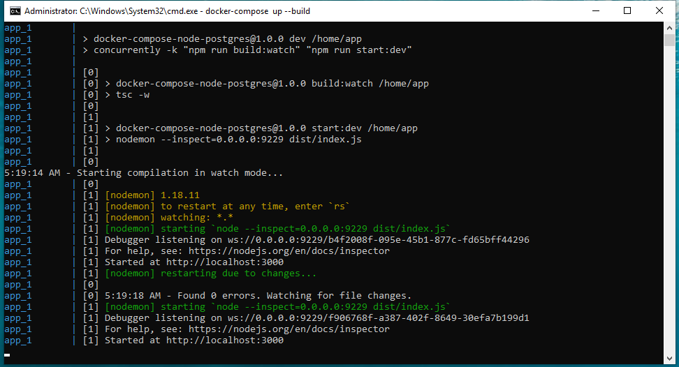

# Docker Compose for Node.js and PostgreSQL

For the sake of making it more real-world, setup has also a build step.

## Demos




## Run

```sh
    docker-compose up --build
```

## Test

```sh
curl http://localhost:3000/ping
# {"environment":"development","database":"up"}
```

## WARNING

Don't keep `.env` file in the repo. It's here as it makes demo example simpler.
